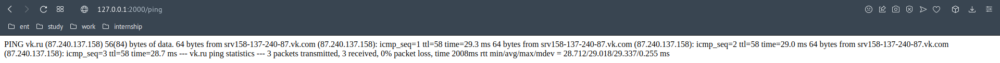
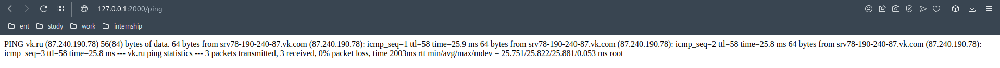

# NCS Lab 4

#### by Valentin Chernyshov

## Description:

this is a NCS lab task where I need to implement a web service with some vilnerability and provide a possible solution to fix it.  
Vulnerability that was implemented here is Command Injection. This a threat when some user action can lead to host terminal access.

## Technical description:

In this particular example service provides a feature when user can use in in order to ping some IP address. It is done by calling ping command on the backend and inserting user parameters inside it. Other example when service need to access command line is fetching some files from the local storage that are requested by user (not implemented in code. this is just possible use case when you need to access command line)

## Exploitation process:

Service has 2 links: `//http://127.0.0.1:2000` just hello page and `//http://127.0.0.1:2000/ping?addr=<ip/domain>` page where user makes a request it self. One can try to extend the command and run some other command additionaly (eg. `addr=foo.com; whoami`).  
Working examples:

`http://127.0.0.1:2000/ping?addr=127.0.0.1%20;%20whoami`  
`http://127.0.0.1:2000/ping?addr=vk.ru%20;%20whoami`

As a result of a command service would print the result of pings an right after the result of `whoami` command

## Some screenshots:

`addr = vk.ru`:  

`addr = vk.ru;%20whoami`

## Recommendations for fixing:

in order to fix in all user input sould be filtered and you it is something strange (in this case not an IP nor Domain) than it should be dropped. The checs are performed this regexp. Fixed code might be found under `//http://127.0.0.1:2000/pingfixed?addr=<ip/domain>` link (seporated section in code)

## link to repo:

## How to run:

In order to run it one should have docker installed and started.

one runs it with start.sh
one stops it with stop_and_clean.sh (also makes a cleanup so there is no need to manualy delete image and container)

code can be found in `main.js`
